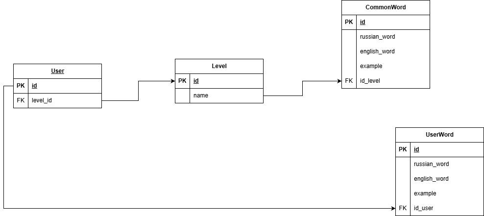

# English Vocabulary Telegram Bot  
### (Educational project expanded with Hugging Face AI integration)

This repository contains a Telegram bot for learning English vocabulary.  
Originally built as a study project, it was later expanded with real AI-generated examples, automatic spelling correction, English-level estimation, and a fully structured database.

You can run it locally, extend it, or use it as a base for more advanced language-learning tools.

---

## 📦 Features

- AI-generated example sentences (Hugging Face API)  
- Vocabulary levels: **A1 → C2**  
- User-added custom words  
- Auto-correction of typos  
- English level estimation via neural network  
- Custom database: Common words + user words  
- Full Telegram bot interaction  
- Clean project structure  

---

## 🔧 Project Structure

```bash
project/
  config.py                 # Credentials, tokens, DSN
  create_tables.py          # SQLAlchemy models + table creation
  seed_data_tables.py       # Initial DB population with words + AI examples
  ai_hf.py                  # Hugging Face API wrapper
  bot.py                    # Main Telegram bot logic
  db_scheme.drawio.png      # Database diagram
  run_cod.py                # Run Telegram bot
  README.md                 # You are here
```

---

## 📚 Requirements

Create a file:

```bash
requirements.txt
```

Add:

```bash
sqlalchemy
requests
pytelegrambotapi
psycopg2-binary
```

---

## 🔑 How to Get Tokens

### 🔹 Telegram Bot Token
1. Open Telegram  
2. Find **@BotFather**  
3. Send: `/newbot`  
4. Follow instructions  
5. Copy the token → paste into `config.py`  

---

### 🔹 Hugging Face API Token
1. Go to https://huggingface.co  
2. Sign up / log in  
3. Open **Settings → Access Tokens**  
4. Create token with scope: *read*  
5. Copy the token → paste into `config.py`

---

## ⚙️ Config Setup

Fill in the credentials inside:

```bash
config.py
```

Example:

```bash
login = 'YOUR-LOGIN'
password = 'YOUR-PASSWORD'
host = 'YOUR-HOST'
port = 'YOUR-PORT'
db_name = 'YOUR_DATA_BASE_NAME'

DB_DSN = f'postgresql://{login}:{password}@{host}:{port}/{db_name}'

TG_BOT_TOKEN = 'YOUR-TOKEN'

HUGGING_FACE_TOKEN = 'YOUR-TOKEN'
```

---

## 🗄️ Database Scheme

The project uses 4 tables:

- **User**
- **Level**
- **CommonWord**
- **UserWord**

Schema located in `db_scheme.drawio.png`:



---

## ▶️ How to Run

1. Install requirements  
2. Start PostgreSQL  
3. Create database `english_bot`  
4. Run table creation:

```bash
python create_tables.py
```

5. Seed initial vocabulary:

```bash
python seed_data_tables.py
```

6. Run Telegram bot:

```bash
python run_cod.py
```

---

## 📄 License

MIT License  
(See LICENSE file)

